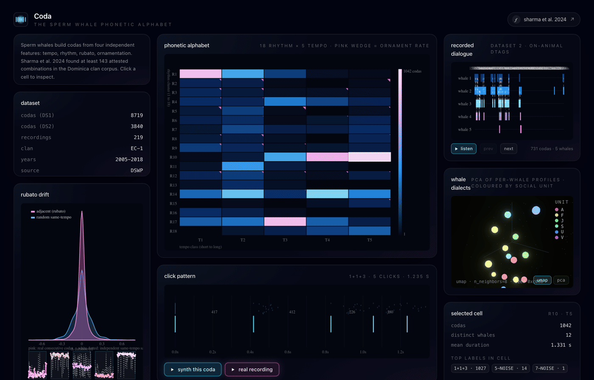

# Coda

Interactive visualisation of the sperm whale phonetic alphabet proposed
by Sharma et al. 2024.



## Background

For decades, sperm whales were thought to use a fixed vocabulary of
about 21 stereotyped "codas" (short bursts of 3 to 12 clicks). Sharma,
Gero, Payne, Gruber, Rus, Torralba and Andreas (Nature Communications,
2024) re-analysed the Dominica clan corpus and showed that codas have
internal structure along four independent dimensions:

  * **tempo**         total duration of the coda, falling into 5 modes
  * **rhythm**        relative spacing of clicks, 18 distinct patterns
  * **rubato**        smooth tempo drift across consecutive codas
  * **ornamentation** an extra click appended at the end, marking the
                      boundaries of conversational turns

These four can be combined freely. At least 143 attested combinations
appear in the corpus. The drift is not random: adjacent codas of the
same class by the same whale match each other in tempo about 30 ms
more closely than random pairs of the same type. The whales are
listening and modulating their own output in response.

This studio renders the four features against the actual published
data and lets you explore the structure directly.

## Panels

| panel | what it shows |
|---|---|
| phonetic alphabet | 18 rhythm clusters × 5 tempo modes, glow encodes the count of codas in the cell, pink wedge encodes the ornament rate. Paper figure 3. |
| click pattern | the click train of the focal coda, ICIs labelled in milliseconds. Two playback buttons: one synthesises the exact click train from this coda's data, the other plays a public-domain NOAA recording. |
| recorded dialogue | dataset 2 timestamps as per-whale lanes; dotted lines mark turn-taking exchanges within 2 seconds. Paper figure 1. |
| rubato drift | duration histogram of adjacent same-class pairs (pink) vs random same-tempo pairs (blue), plus five example walks. In each walk the pink line traces the actual sequence from one whale and the white dotted line shows independent draws from the broader same-tempo population, so the whale's narrow band sits inside a much wider scatter. Paper figure 2c. |
| whale dialects | one point per whale, three-dimensional UMAP (with a PCA toggle) of each whale's full feature profile (mean tempo, rhythm histogram, ornament rate, rubato drift, log coda count). Coloured by social unit. Hover for the whale's stats. |
| selected cell | drill-down on the highlighted rhythm-tempo combination: codas, distinct whales, mean duration, top coda labels. |

## Stack

Next.js 16, React 19, TypeScript, Tailwind v4, Canvas 2D for all
plotting, Web Audio for the synthesised click trains. No charting
libraries, no Python at runtime.

## Data

`public/codas.csv` and `public/dialogues.csv` mirror the supplementary
data of the Sharma 2024 paper, redistributed under the same CC-BY
licence as the article. Source repository:

https://github.com/pratyushasharma/sw-combinatoriality

The Dominica Sperm Whale Project recorded the EC-1 clan in the Eastern
Caribbean between 2005 and 2018. Dataset 1 contains 8 719 annotated
codas with up to nine inter-click intervals each. Dataset 2 contains
3 948 timestamped codas from on-animal DTags with the speaker preserved.

`public/sperm-whale.ogg` is a NOAA recording in the public domain,
mirrored from
https://commons.wikimedia.org/wiki/File:Sperm_Whale_Rapid_Clicks_and_Coda.ogg

## Paper

Pratyusha Sharma, Shane Gero, Roger Payne, David F. Gruber, Daniela
Rus, Antonio Torralba, Jacob Andreas. *Contextual and combinatorial
structure in sperm whale vocalisations.* Nature Communications 15,
3617 (2024). https://www.nature.com/articles/s41467-024-47221-8

## Run

```bash
npm install
npm run dev
```

Then open http://localhost:3000.

## Notes on methodology

The four-feature decomposition is implemented in `lib/features.ts`:

  * **tempo** is the total coda duration, taken from the CSV
    `Duration` column. Quantile binning into five classes recovers the
    modes Sharma identifies via KDE.
  * **rhythm** is the ICI vector divided by total duration. k-means
    with k=18 in normalised-ICI space yields the rhythm classes.
  * **ornamentation** is detected when the final ICI exceeds the median
    of the preceding ICIs by a tuned ratio. The resulting rate is about
    4%, matching the paper.
  * **rubato** is implemented in `components/RubatoPanel.tsx`. The
    histogram compares the absolute duration difference between
    consecutive same-class same-whale pairs against random pairs from
    the same tempo class. The example walks pick five whale-class
    cells whose internal duration spread is much tighter than the
    same-tempo population, then plot the real sequence alongside an
    independent reference drawn from other whales of the same tempo
    class. The contrast between the narrow pink band and the wider
    white scatter is the rubato signal.

The whale-dialect scatter defaults to a seeded three-dimensional UMAP
(`umap-js`, deterministic via a fixed PRNG seed) which surfaces the
non-linear sub-structure between social units more clearly than PCA
on this small ~60-whale sample. A PCA toggle is wired up too,
implemented in `lib/pca.ts` as power iteration with deflation on the
centred and standardised covariance matrix. PCA preserves global
distance and is useful for comparing how strongly the unit labels
fall out under a strictly linear projection.
